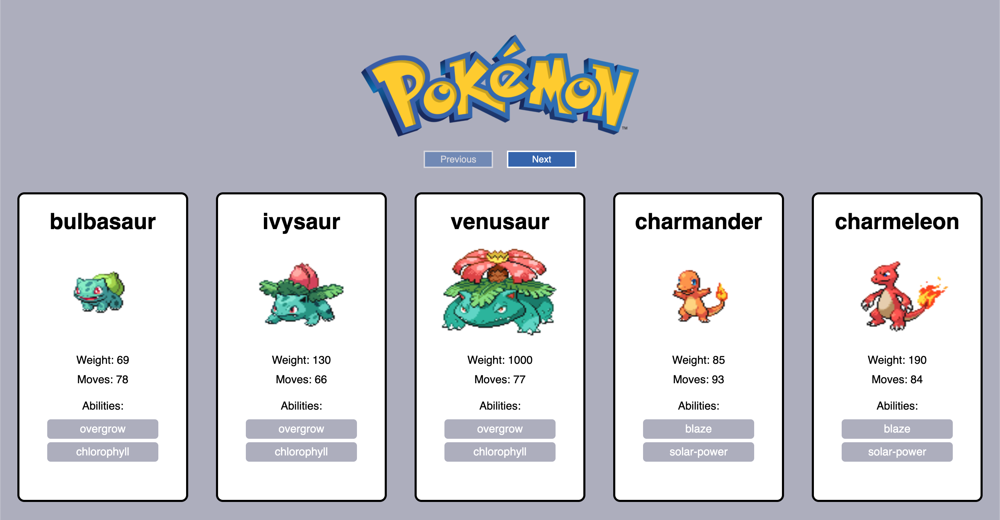

# Frontend-react-pokemon

## Introduction
This project was bootstrapped with [Create React App](https://github.com/facebook/create-react-app).

This repository will be updated in the future with new features as my knowledge grows.
## Final

## Getting started
In the project directory, you can run:

`npm install`

Run `npm start`, to run the app in the development mode.
Open http://localhost:3000 to view it in the browser.

`npm start`

## Requirements (in dutch for reviewing purposes)
Je gaat Pokémon data ophalen via de Poké API en deze weergeven in een Single Page Application. Hier heb je geen API key voor nodig!

Bekijk de documentatie van de Poké API [hier](https://pokeapi.co/) en gebruik vooral hun handige data-preview tool!

* Op de home pagina laat je direct de eerste twintig Pokémons uit het deck zien.
* Elk pokémon kaartje bevat een _naam_, een afbeelding, lijst van _abilities_, _gewicht_, en de hoeveelheid _moves_. 
* Er bevinden zich twee knoppen op de pagina: '_Vorige_' en '_Volgende_'. Wanneer de gebruiker op '_Volgende_' klikt, worden de volgende 20 pokémons in de reeks opgehaald. 
De knoppen worden automatich _disabled_ wanneer het begin of eind van de reeks bereikt is.
* De gebruiker wordt via de interface geinformeerd wanneer er data wordt opgehaald of een fout is opgetreden.
* Laat je niet uit het veld slaan als WebStorm sommige object keys van de data die je binnenhaalt niet herkent. Kan Webstorm niks aan doen.

Ga voor jezelf na wat een handige plek is om te beginnen met ontwikkelen en stel voor jezelf globale stappen op. Mocht je dat nog lastig vinden, kun je ook onderstaande stappen volgen.
